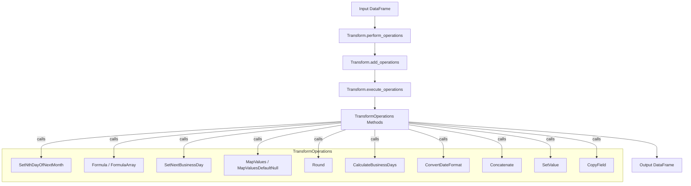

# Data Transformation Utility

This module provides a flexible framework for applying a series of data transformations to pandas DataFrames, driven by configuration.

## Overview

The codebase is centered around two main classes:

- **TransformOperations**: Contains a suite of data transformation methods.
- **Transform**: Manages and executes a sequence of transformation operations on a DataFrame, based on a configuration.

---

## Classes and Methods

### TransformOperations

A collection of methods for common data transformation tasks. Each method typically takes two arguments:
- `data_df`: The pandas DataFrame to operate on.
- `args`: A dictionary of arguments specifying the transformation parameters (usually from a configuration DataFrame).

#### Methods

##### `SetNthDayOfNextMonth(data_df, args)`
- **Purpose:** Calculates the nth weekday of the next month for each row, with support for historical months.
- **Arguments:**
  - `DataSetName`: Name of the dataset to filter.
  - `TransformInputs`: Semicolon-separated string: frequency;start_date;weekday;n;number_of_months_history.
  - `NewFieldName`: Name of the output field.
- **How it works:**
  - Filters the DataFrame for the specified dataset and frequency ('MTH').
  - Converts weekday names to numbers, parses dates, and computes the nth weekday for the current and previous months.
  - Appends results to the DataFrame.

##### `Formula(data_df, args)`
- **Purpose:** Evaluates a formula (as a string) on specified columns, supporting type conversion and temporary columns.
- **Arguments:**
  - `TransformFromValueOrFormulaInputTypes`: Comma-separated types for each input field (e.g., 'str,int').
  - `TransformInputs`: Comma-separated input field names.
  - `TransformToValueOrFormula`: The formula as a string (e.g., 'A+B').
  - `DataSetName`: Name of the dataset to filter.
  - `NewFieldName`: Name of the output field.
- **How it works:**
  - Converts input columns to the specified types, creates temporary columns, and replaces field names in the formula with temp columns.
  - Uses `exec` to evaluate the formula for each row and assigns the result to the output field.

##### `FormulaArray(data_df, args)`
- **Purpose:** Applies the `Formula` method to either a specific dataset or all data.
- **Arguments:**
  - Same as `Formula`.
- **How it works:**
  - If `DataSetName` is not 'AllData', applies the formula to the filtered subset; otherwise, applies to the whole DataFrame.
  - Handles errors by logging and falling back to the base `Formula` method.

##### `SetNextBusinessDay(data_df, args)`
- **Purpose:** Finds the next business day after a given date, with support for historical days.
- **Arguments:**
  - `DataSetName`: Name of the dataset to filter.
  - `TransformInputs`: Semicolon-separated string: frequency;start_date;number_of_days_history.
  - `NewFieldName`: Name of the output field.
- **How it works:**
  - Filters for the specified dataset and frequency ('DAIL').
  - Computes the next business day for each row and for a specified number of previous days, appending results to the DataFrame.

##### `set_nth_day_month(frequency, month, year, day_of_week, n)` (static)
- **Purpose:** Helper for `SetNthDayOfNextMonth` to compute the nth weekday of a month.
- **Arguments:**
  - `frequency`: Should be 'MTH'.
  - `month`, `year`: Integers for the month and year.
  - `day_of_week`: Integer (0=Mon, 6=Sun).
  - `n`: The nth occurrence (1-5).
- **How it works:**
  - Finds the first possible day, adjusts for the weekday, and returns the date as a string.

##### `MapValues(data_df, args)`
- **Purpose:** Maps values from one set to another for a given field.
- **Arguments:**
  - `DataSetName`: Name of the dataset to filter.
  - `TransformInputs`: Name of the input field.
  - `NewFieldName`: Name of the output field.
  - `TransformFromValueOrFormulaInputTypes`: Comma-separated list of values to map from.
  - `TransformToValueOrFormula`: Comma-separated list of values to map to.
  - `TransformComparator`: Separator (default ',').
- **How it works:**
  - Builds a mapping dictionary and replaces values in the specified field.

##### `MapValuesDefaultNull(data_df, args)`
- **Purpose:** Maps values as in `MapValues`, but sets output to null if no mapping is found or if the target values are empty.
- **Arguments:**
  - Same as `MapValues`.
- **How it works:**
  - If no target values, sets all outputs to null. Otherwise, maps values and sets unmapped values to null.

##### `Round(data_df, args)`
- **Purpose:** Rounds numeric values to a specified precision.
- **Arguments:**
  - `DataSetName`: Name of the dataset to filter.
  - `TransformInputs`: Name of the input field.
  - `NewFieldName`: Name of the output field.
  - `TransformComparator`: Precision (number of decimal places).
- **How it works:**
  - Converts the input field to numeric, rounds to the specified precision, and assigns to the output field.

##### `CalculateBusinessDays(data_df, args)`
- **Purpose:** Calculates the number of business days between two dates, using a holiday calendar CSV.
- **Arguments:**
  - `TransformInputs`: Semicolon-separated list of four fields (calendar key, start date, end date, etc.).
  - `TransformFromValueOrFormulaInputTypes`: Semicolon-separated list of types for each input field.
  - `DataSetName`: Name of the dataset to filter.
  - `NewFieldName`: Name of the output field.
- **How it works:**
  - Merges with a holiday calendar, preprocesses dates, and uses numpy's `busday_count` to compute business days.

##### `ConvertDateFormat(data_df, args)`
- **Purpose:** Converts date strings from one format to another, with optional concatenation of multiple fields.
- **Arguments:**
  - `DataSetName`: Name of the dataset to filter.
  - `TransformInputs`: Semicolon-separated list of input fields.
  - `NewFieldName`: Name of the output field.
  - `TransformFromValueOrFormulaInputTypes`: Input date format string.
  - `TransformToValueOrFormula`: Output date format string.
- **How it works:**
  - Concatenates input fields if needed, parses dates, and formats them to the new format.

##### `Concatenate(data_df, args)`
- **Purpose:** Concatenates multiple fields or strings into a new field.
- **Arguments:**
  - `DataSetName`: Name of the dataset to filter.
  - `NewFieldName`: Name of the output field.
  - `TransformInputs`: Comma-separated list of fields or strings to concatenate.
- **How it works:**
  - Builds a concatenation expression and evaluates it for each row, assigning the result to the output field.

##### `SetValue(data_df, args)`
- **Purpose:** Sets a field to a constant value for all rows in the dataset.
- **Arguments:**
  - `TransformComparator`: The value to set.
  - `DataSetName`: Name of the dataset to filter.
  - `NewFieldName`: Name of the output field.
- **How it works:**
  - Sets the output field to the specified value (or null if not provided) for all rows in the dataset.

##### `CopyField(data_df, args)`
- **Purpose:** Copies the value from one field to another.
- **Arguments:**
  - `NewFieldName`: Name of the output field.
  - `TransformInputs`: Name of the input field.
  - `DataSetName`: Name of the dataset to filter.
- **How it works:**
  - Copies the values from the input field to the output field for all rows in the dataset.

---

### Transform

A manager class for orchestrating a sequence of transformations.

#### Methods

##### `__init__()`
- **Purpose:** Initializes the Transform class with an instance of TransformOperations and an empty list of operations.

##### `add_operations(function_name, args)`
- **Purpose:** Adds a transformation operation to the list.
- **Arguments:**
  - `function_name`: Name of the transformation function (string).
  - `args`: Arguments for the transformation (dict).
- **How it works:**
  - Fetches the corresponding method from TransformOperations and appends it with its arguments to the operations list.

##### `execute_operations(data_df)`
- **Purpose:** Executes all added operations on the input DataFrame.
- **Arguments:**
  - `data_df`: The DataFrame to transform.
- **How it works:**
  - Iterates through the list of operations, applying each to the DataFrame in sequence.
  - Logs and raises errors if encountered.

##### `perform_operations(configdf, data_df)`
- **Purpose:** Reads a configuration DataFrame and applies all specified transformations to the input DataFrame.
- **Arguments:**
  - `configdf`: Configuration DataFrame specifying the transformations.
  - `data_df`: Input DataFrame.
- **How it works:**
  - Iterates through the configuration, adds each operation, and executes them in order.

---

## Usage

1. Prepare your input DataFrame and a configuration DataFrame specifying the transformations.
2. Create a `Transform` object.
3. Call `perform_operations(configdf, data_df)` to apply all transformations.

### Example

```python
from app import Transform

transformer = Transform()
result_df = transformer.perform_operations(config_df, input_df)
```

## Requirements

- Python 3.x
- pandas
- numpy
- pytz

## Notes

- The transformation logic is highly configurable and can be extended by adding new methods to `TransformOperations`.
- The configuration DataFrame should specify the function names and arguments for each transformation step. 

---

## Practical Example

Suppose you have a DataFrame with columns `A`, `B`, and `C`, and you want to:
- Add a new column `Sum` as the sum of `A` and `B`.
- Convert a date column `C` from 'YYYYMMDD' to 'YYYY-MM-DD'.

**Sample code:**

```python
import pandas as pd
from app import Transform

# Example input DataFrame
data = {
    'A': [1, 2, 3],
    'B': [4, 5, 6],
    'C': ['20240101', '20240201', '20240301'],
    'DataSetName': ['main', 'main', 'main']
}
df = pd.DataFrame(data)

# Example configuration DataFrame
config = pd.DataFrame([
    {
        'TransformFunction': 'Formula',
        'TransformInputs': 'A,B',
        'TransformFromValueOrFormulaInputTypes': 'int,int',
        'TransformToValueOrFormula': 'A+B',
        'DataSetName': 'main',
        'NewFieldName': 'Sum',
        'TransformComparator': ''
    },
    {
        'TransformFunction': 'ConvertDateFormat',
        'TransformInputs': 'C',
        'TransformFromValueOrFormulaInputTypes': '%Y%m%d',
        'TransformToValueOrFormula': '%Y-%m-%d',
        'DataSetName': 'main',
        'NewFieldName': 'C_formatted',
        'TransformComparator': ''
    }
])

transformer = Transform()
result_df = transformer.perform_operations(config, df)
print(result_df)
```

---

## Data Flow Diagram



---

## Quick Reference Table

| Method                      | Purpose                                                      | Key Args (from config)                                   |
|-----------------------------|--------------------------------------------------------------|----------------------------------------------------------|
| SetNthDayOfNextMonth        | Nth weekday of next month, with history                      | DataSetName, TransformInputs, NewFieldName               |
| Formula / FormulaArray      | Apply formula to columns                                     | TransformInputs, TransformFromValueOrFormulaInputTypes, TransformToValueOrFormula, DataSetName, NewFieldName |
| SetNextBusinessDay          | Next business day after a date                               | DataSetName, TransformInputs, NewFieldName               |
| MapValues                   | Map values from one set to another                           | DataSetName, TransformInputs, NewFieldName, TransformFromValueOrFormulaInputTypes, TransformToValueOrFormula, TransformComparator |
| MapValuesDefaultNull        | Map values, set to null if no mapping                        | Same as MapValues                                        |
| Round                       | Round numeric values                                         | DataSetName, TransformInputs, NewFieldName, TransformComparator |
| CalculateBusinessDays       | Business days between two dates (uses holiday calendar)      | TransformInputs, TransformFromValueOrFormulaInputTypes, DataSetName, NewFieldName |
| ConvertDateFormat           | Convert date string format                                   | DataSetName, TransformInputs, NewFieldName, TransformFromValueOrFormulaInputTypes, TransformToValueOrFormula |
| Concatenate                 | Concatenate fields/strings                                   | DataSetName, NewFieldName, TransformInputs               |
| SetValue                    | Set a field to a constant value                              | DataSetName, NewFieldName, TransformComparator           |
| CopyField                   | Copy value from one field to another                         | DataSetName, NewFieldName, TransformInputs               |

---

For more details on each method, see the detailed documentation above. 